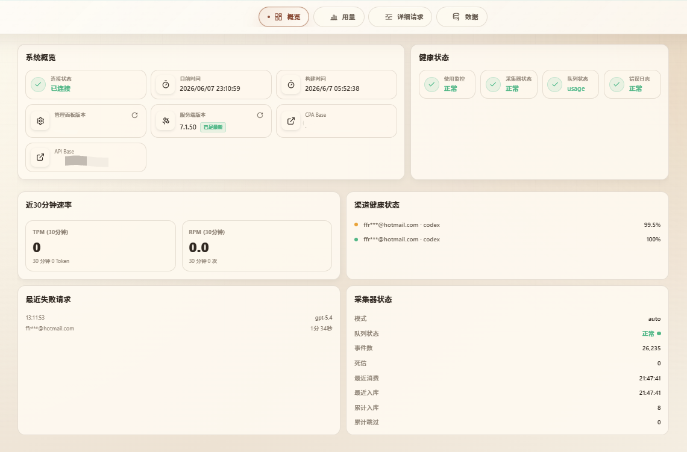
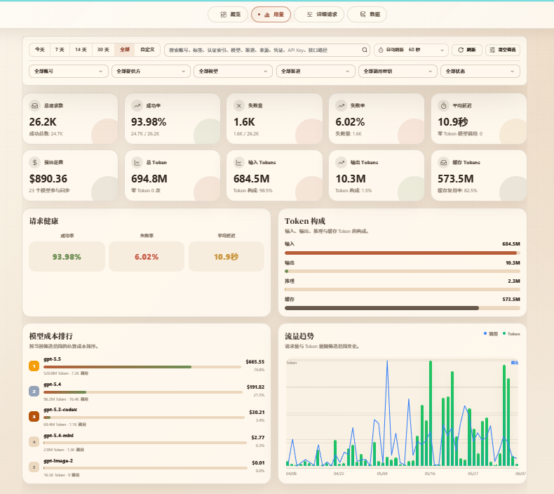
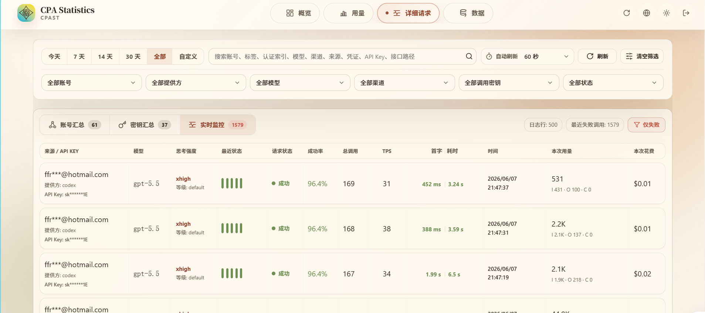
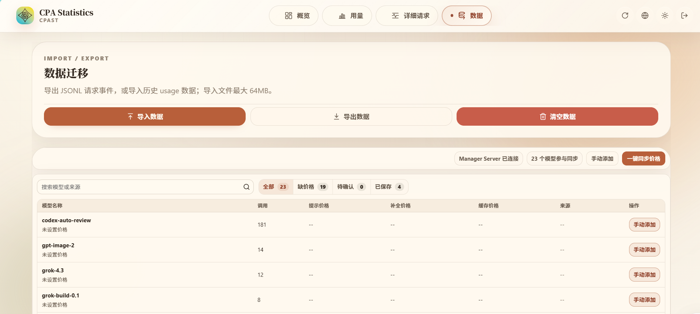

# CPA Statistics 

CPA Statistics 是一个用于 CLIProxyAPI / CPA 使用情况统计与管理的面板。功能有概览、用量统计、请求详情、数据导入导出、模型价格管理。

## 项目截图

### 1. 概览页



### 2. 用量页



### 3. 详细请求页



### 4. 数据页



## 功能

- 概览仪表盘
- 用量统计
- 请求监控与请求详情
- 数据导入、导出、清空
- 模型价格管理

## 环境要求

推荐使用 Docker Compose 部署。

- Docker
- Docker Compose
- 已运行的 CLIProxyAPI / CPA 服务
- 可访问 CPA 管理接口的地址和管理密码

如果使用源码部署，还需要：

- Linux
- Node.js 22 或更高版本
- Go 1.24 或更高版本
- Git

## Docker Compose 快捷部署（推荐）

### 1. 新建部署目录

```bash
mkdir cpa-statistics
cd cpa-statistics
```

### 2. 创建 `manager-config.yaml`

```yaml
server:
  listen: "0.0.0.0:8318"
  dataDir: "/data"
  dbPath: "/data/usage.sqlite"
admin:
  password: "请改成你的管理面板密码"
cpa:
  url: "http://你的-CPA-地址:8317"
  password: "你的 CPA 管理密码"
collector:
  mode: "auto"
  queue: "usage"
  popSide: "right"
  batchSize: 100
  pollIntervalMs: 500
  queryLimit: 50000
security:
  dataKeyPath: "/data/data.key"
  tlsSkipVerify: false
cors:
  origins: ["*"]
```

### 3. 创建 `docker-compose.yml`

```yaml
services:
  cpa-statistics:
    image: petmax/cpa-statistics:latest
    restart: unless-stopped
    ports:
      - "8318:8318"
    environment:
      CPA_MANAGER_CONFIG: "/app/manager-config.yaml"
      CPA_MANAGER_DATA_KEY_PATH: "/data/data.key"
    volumes:
      - ./manager-config.yaml:/app/manager-config.yaml:ro
      - cpa-statistics-data:/data
    healthcheck:
      test: ["CMD", "wget", "-qO-", "http://127.0.0.1:8318/health"]
      interval: 10s
      timeout: 3s
      retries: 3

volumes:
  cpa-statistics-data:
```

### 4. 启动服务

```bash
docker compose up -d
```

也可以先手动拉取镜像：

```bash
docker pull petmax/cpa-statistics:latest
docker compose up -d
```

访问管理面板：

```text
http://服务器IP:8318/management.html
```

健康检查：

```text
http://服务器IP:8318/health
```

常用入口：

- 概览：`/management.html#/overview`
- 用量：`/management.html#/usage`
- 请求详情：`/management.html#/request-details`
- 数据：`/management.html#/data`

## 自行构建 Docker 镜像

1. 克隆项目：

```bash
git clone https://github.com/Pet-Max/CPA-Statistics
cd CPA-Statistics
```

2. 复制示例配置并编辑 `manager-config.yaml`：

```bash
cp manager-config.example.yaml manager-config.yaml
```

```yaml
server:
  listen: "0.0.0.0:8318"
  dataDir: "/data"
  dbPath: "/data/usage.sqlite"
admin:
  password: "请改成你的管理面板密码"
cpa:
  url: "http://你的-CPA-地址:8317"
  password: "你的 CPA 管理密码"
collector:
  mode: "auto"
  queue: "usage"
  popSide: "right"
  batchSize: 100
  pollIntervalMs: 500
  queryLimit: 50000
security:
  dataKeyPath: "/data/data.key"
  tlsSkipVerify: false
cors:
  origins: ["*"]
```

3. 本地构建镜像：

```bash
docker build -f Dockerfile.manager-server -t cpa-statistics:local .
```

4. 使用本地镜像启动服务：

```bash
docker run -d \
  --name cpa-statistics \
  -p 8318:8318 \
  -v "$PWD/manager-config.yaml:/app/manager-config.yaml:ro" \
  -v cpa-statistics-data:/data \
  -e CPA_MANAGER_CONFIG=/app/manager-config.yaml \
  -e CPA_MANAGER_DATA_KEY_PATH=/data/data.key \
  cpa-statistics:local
```

5. 访问管理面板：

```text
http://服务器IP:8318/management.html
```

说明：自行构建镜像会在本地执行前端构建和后端编译，适合开发、二次修改或自定义镜像的用户。

## Linux 源码部署

1. 安装依赖：

```bash
sudo apt update
sudo apt install -y git curl wget
```

安装 Node.js 22 和 Go 1.24 后，确认版本：

```bash
node -v
npm -v
go version
```

2. 克隆项目并安装前端依赖：

```bash
git clone https://github.com/Pet-Max/CPA-Statistics
cd CPA-Statistics
cp manager-config.example.yaml manager-config.yaml
npm ci
```

3. 构建前端：

```bash
npm run build
```

4. 将前端单文件产物放入后端内嵌目录：

```bash
cp apps/web/dist/index.html apps/manager-server/internal/httpapi/web/management.html
```

5. 构建后端：

```bash
mkdir -p bin
cd apps/manager-server
go mod download
go build -o ../../bin/cpa-statistics ./cmd/cpa-statistics
cd ../..
```

6. 调整本地运行配置：

源码运行建议把 `manager-config.yaml` 中的数据路径改为相对路径：

```yaml
server:
  listen: "0.0.0.0:8318"
  dataDir: "./data"
  dbPath: "./data/usage.sqlite"
security:
  dataKeyPath: "./data/data.key"
```

7. 启动服务：

```bash
CPA_MANAGER_CONFIG="$PWD/manager-config.yaml" ./bin/cpa-statistics
```

访问：

```text
http://服务器IP:8318/management.html
```

## 常用命令

查看 Docker 日志：

```bash
docker compose -f docker-compose.yml logs -f
```

停止 Docker 服务：

```bash
docker compose -f docker-compose.yml down
```

拉取最新 Docker 镜像并启动：

```bash
docker compose pull
docker compose up -d
```

如果你修改了源码并需要重新构建本地镜像：

```bash
git pull
docker build -f Dockerfile.manager-server -t cpa-statistics:local .
```

健康检查：

```text
http://服务器IP:8318/health
```

## 配置说明

- `admin.password`：登录 CPA Statistics 管理面板的密码
- `cpa.url`：CLIProxyAPI / CPA 服务地址
- `cpa.password`：CPA 管理密码
- `collector.mode`：采集模式，默认 `auto`。
- `security.dataKeyPath`：数据加密密钥路径，请妥善保存
- Docker 部署默认使用 `8318` 端口，对外访问 `http://服务器IP:8318/management.html`。

## 项目来源

- 上游项目：https://github.com/router-for-me/CLIProxyAPI
- 参考项目：https://github.com/seakee/CPA-Manager-Plus

## 注意事项

- Docker 数据保存在 `cpa-statistics-data` volume 中，执行 `docker compose down -v` 会删除数据
- 首次部署前请确认 CLIProxyAPI / CPA 服务已正常运行

## License

MIT License
